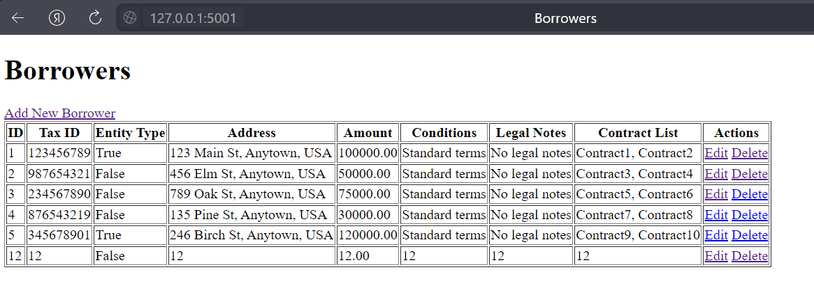

# Первая лабораторная работа по базам данных
Скрипт для создания БД: [скрипт](BankDB.sql)

Схема состоящая из трех таблиц: [скрипт](imagesForLab\image.png)

Схема состоящая из четырех таблиц: [скрипт](imagesForLab\image2.png)

Используемый язык для реализации поставленной задачи: Python

## Запуск
Для запуска необходимо установить все зависимости:
```
python -m pip install Flask Flask-SQLAlchemy Flask-WTF mysql-connector-python flash
```
После чего запустить проект с помощью команды:
```
python index.py
```

## Скриншоты созданного приложения
Для изменения, добавления и удаление доступны все объекты. Предусмотрена обработка ошибок, например, при попытке удалить объект, на который ссылается другой объект в БД.
### Все таблицы




### Изменение объекта


### Добавление объекта

### Попытка удалить (на него ссылается другой, поэтому не удалось)


